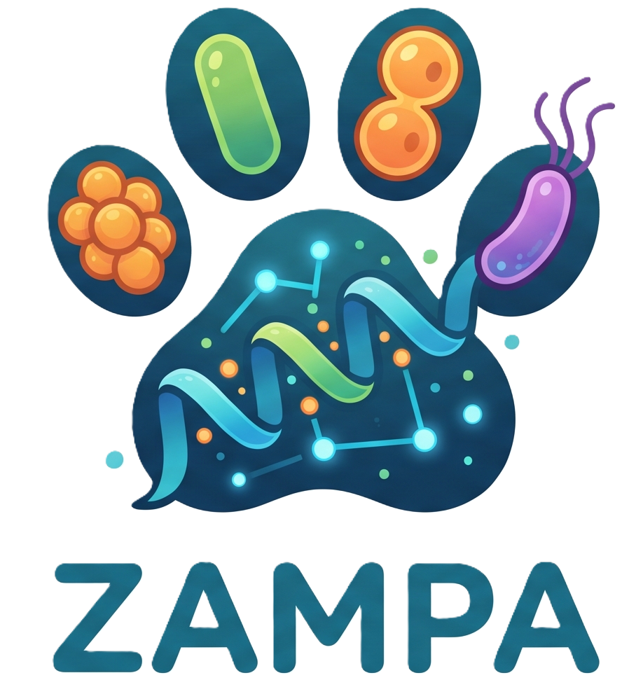

# Project Zampa
Zero-shot AntiMicrobial Peptide generation using AI

# Thoughtflow

- We all talk about model capability overhang narrative.
- That is SOTA frontier models have all these skills and capabilities hidden in plain sight baked into their weights waiting for it to be prompted out
- In this project we try and understand if some of the SOTA frontier models have already mastered the artform of generating AntiMicrobial Peptides

# Why this hunch?
- SOTA LLMs have ingested more papers and peer-reviewed work and datasets than any human expert could possibly imagine
- They are verifiably good at summarizing the vulnerability points of a pathogen
- They are verifiably good at listing all the positive desiderata to be imbibed into a good AMP
- They are verifiably good at listing all the negative desiderata to *NOT* be imbibed into a good AMP
- They are aware of all the current SOTA datasets of AMPs and hence could potentially be able to generate novel ones far away from the manifold of previously harvested ones

  # Prompt used

  # Public links for all the models

## ABACUS AI
https://apps.abacus.ai/chatllm/agent?convoId=b4f7f226c
- Credits: 4,701

## CHATGPT 5.6 Sol | Extra high | Fast
https://chatgpt.com/g/g-p-6a3f1e427f98819191ddd692e1941b87/c/6a6a4838-ea30-83e8-a6f9-639806cfbd57
- Worked for 77m 14s

## Opus 4.8 | Max
https://claude.ai/share/2d4f8e19-3998-4fcd-a9ef-0136893dcfcd

## Edison - KOSMOS-Agent: Molecules
https://playground.edisonscientific.com/tasks/9bd315a9-39d7-4428-be95-64fbb8391a20

  
